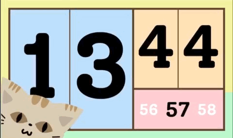
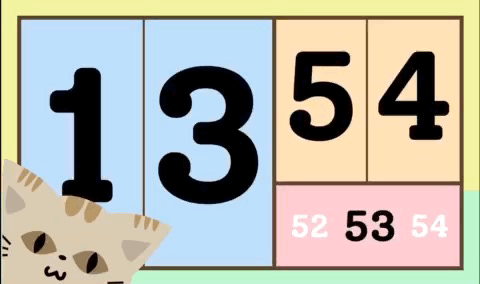
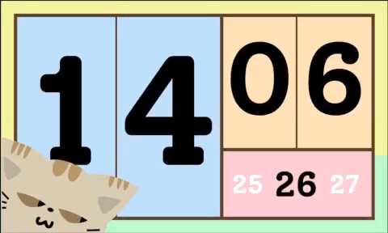
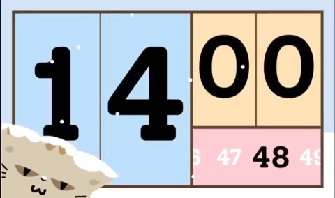
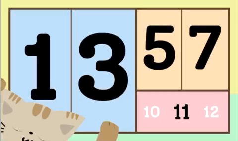
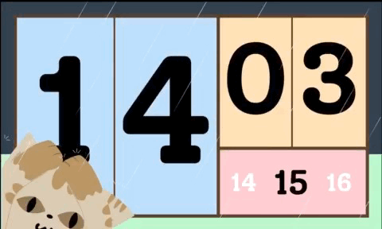
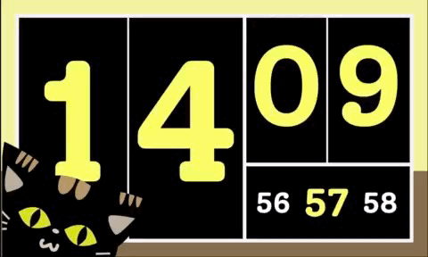

# Flutter Clock

Welcome to Flutter Clock!

See [flutter.dev/clock](https://flutter.dev/clock) for how to get started, submission requirements, contest rules, and FAQs.

See a [live demo](https://maryx.github.io/flutter_clock) with Flutter for Web!

# Flutter Cat

A clock UI with a cat inside to accompany you through your day every day no matter how's the weather that day.

in your cloudy day

in your windy day

in your snowy day

in your rainy day

even in thunderstorm

the cat also available in dark mode

